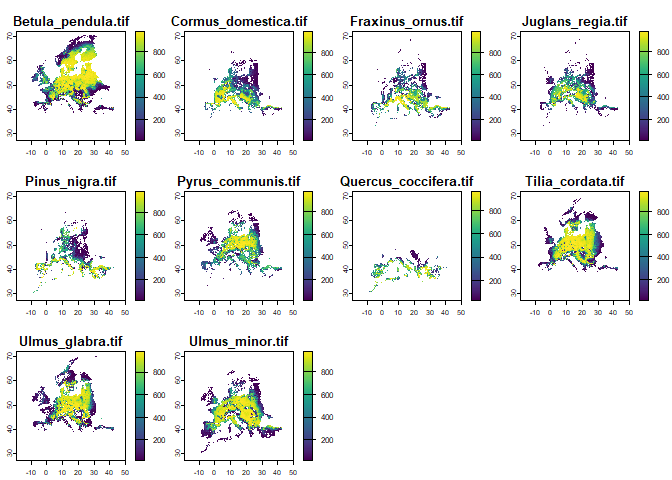

Zonation5R
================

<a href="https://github.com/thiago-cav/Zonation5R">

</a>

[](https://www.gnu.org/licenses/gpl-3.0)

*Zonation5R* is an R package that provides an interface to easily
integrate and execute Zonation 5 software directly from R. The package
was developed to support teaching and learning, making it easier for R
users to get started with Zonation 5 and learn spatial prioritization
techniques. It also facilitates efficient spatial prioritization
workflows, improving both reproducibility and automation.

## Installation

You can install the development version of *Zonation5R* from
[GitHub](https://github.com/thiago-cav/Zonation5R) with:

``` r
if (!require(devtools)) install.packages("devtools")
devtools::install_github("thiago-cav/Zonation5R")
```

## Getting started

``` r
# Load necessary libraries
library(Zonation5R)
library(terra)  # For plotting
```

This is the most basic example to get a simple setup running with
*Zonation5R*. Since this package serves as an interface, we need to make
sure Zonation has access to the necessary input files. That means we
must either use a physical directory or a writable temporary directory.
To get started, let’s copy the example data from the package into a
working directory and make a quick plot.

``` r
#----------------------------------------------------
# Define a writable directory for Zonation processing
#----------------------------------------------------
# writable_dir <- "C:/Users/YourName/Documents/ZonationRuns/my_zonation_run"
writable_dir <- tempdir()

# Set working directory so Zonation5R functions write/read files correctly
setwd(writable_dir)

#----------------------------------------------------
# Copy example biodiversity data into a subfolder
#----------------------------------------------------
biodiv_data_dir <- file.path(writable_dir, "biodiversity")
dir.create(biodiv_data_dir, showWarnings = FALSE)

extdata_path <- system.file("extdata", "biodiversity", package = "Zonation5R")
file.copy(list.files(extdata_path, full.names = TRUE), biodiv_data_dir, overwrite = TRUE)

#----------------------------------------------------
# Load and plot biodiversity data
#----------------------------------------------------
spp_files <- list.files(biodiv_data_dir, pattern = "\\.tif$", full.names = TRUE)
biodiv_stack <- rast(spp_files)

# Use file names as layer names for automatic plot titles
names(biodiv_stack) <- basename(spp_files)

# Plot the biodiversity input layers
plot(biodiv_stack)
```

<!-- -->

Now we can use the four core functions of *Zonation5R* to create the
three compulsory input files and run the analysis. One key thing to pay
attention to is the `zonation_path` argument in the
`create_zonation5_call()` function. This specifies the path to the
Zonation 5 installation on your computer, so make sure it’s correctly
set.

``` r
#----------------------------------------------------
# Zonation 5 setup
#----------------------------------------------------

# Create feature list file 
create_feature_list(spp_file_dir = biodiv_data_dir)  # Use variable for the directory

# Create settings file
create_settings_file(feature_list_file = "feature_list.txt")

# Create the Zonation call (adjust the path to where Zonation 5 is installed)
create_zonation5_call(
  zonation_path = "C:/Program Files (x86)/Zonation5",
  marginal_loss_mode = "CAZMAX",
  settings_file = "settings_file.z5"
)

#----------------------------------------------------
# Run Zonation 5 prioritization
#----------------------------------------------------
run_zonation5(writable_dir)  # Use variable for the directory
```

Finally, we can visualize the priority rank map - a key output of
Zonation 5. This map is a floating-point raster where each grid cell is
ranked from lowest to highest priority. The rank values range from 0
(indicating the lowest priority, shown in dark purple) to 1 (indicating
the highest priority, shown in yellow).

``` r
#----------------------------------------------------
# Plot the resulting rankmap
#----------------------------------------------------
rankmap_path <- file.path(writable_dir, "output", "rankmap.tif")
rankmap_raster <- rast(rankmap_path)
plot(rankmap_raster, main = "Zonation 5 Rank Map")
```

<!-- -->

``` r
# Clean up
# WARNING: This deletes the entire directory! Only do this for temporary folders.
unlink(writable_dir, recursive = TRUE)
```

## Developers

Thiago Cavalcante  
ORCID: [0000-0001-5357-9659](https://orcid.org/0000-0001-5357-9659)  
Email: <thiago.cavalcante@helsinki.fi>

This package has been shaped by many trials and errors, and it is
constantly being refined. As such, contributions, suggestions, and
feedback are always welcome—after all, *“it doesn’t matter if your first
version isn’t perfect as long as the next version is better”*.
